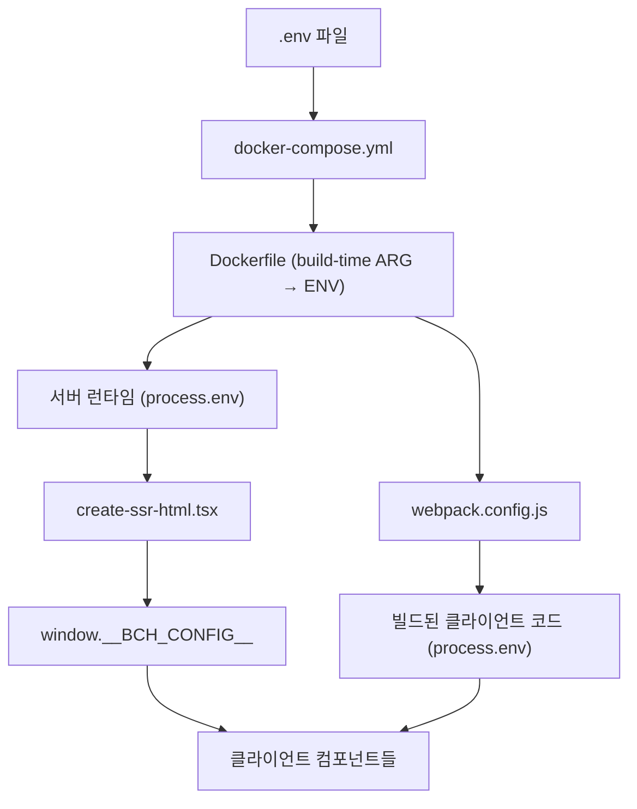

# Environment Variables Flow Documentation

## 📋 개요
이 문서는 Oratio 시스템에서 환경변수가 `.env` 파일부터 브라우저까지 전달되는 완전한 체인을 설명합니다.

## 🔄 전체 환경변수 전달 체인



## 📁 관련 파일 목록

### **1단계: 환경변수 정의 및 Docker 설정**
- **`.env`** - 환경변수 정의
- **`docker-compose.yml`** - Docker 빌드/런타임 args 및 environment 설정
- **`Dockerfile`** - ARG → ENV 변환

### **2단계: 빌드 타임 처리**
- **`webpack.config.js`** - 환경변수를 클라이언트 코드에 주입
- `src/shared/build-config.js` - 빌드 설정 (직접적 BCH 관련 없음)

### **3단계: 서버 사이드 처리**
- `src/server/index.tsx` - Express 서버 엔트리포인트
- `src/server/handlers/catch-all-handler.tsx` - 모든 라우트 처리, SSR 호출
- **`src/server/utils/create-ssr-html.tsx`** - **핵심**: `window.__BCH_CONFIG__` 생성

### **4단계: 클라이언트 사이드 처리**
- `src/client/index.tsx` - 클라이언트 엔트리포인트
- **`src/shared/components/app/navbar.tsx`** - BCH 잔고 표시
- **`src/shared/utils/bch-payment.ts`** - BCH 유틸리티 함수들
- `src/shared/components/common/ad-banner.tsx` - 광고 배너 (BCH 크레딧 체크)

## 🔍 단계별 상세 분석

### **1단계: 환경변수 정의**

#### **`.env` 파일**
```properties
# BCH 관련 환경변수
LEMMY_API_KEY=
# BCH 결제 서비스 URL - 서브경로로 서비스
LEMMY_BCH_API_URL=https://oratio.space/payments/api/user_credit
LEMMY_BCH_PAYMENT_URL=https://oratio.space/payments/
```

#### **`docker-compose.yml`**
```yaml
lemmy-ui:
  build:
    args:
      - LEMMY_API_KEY=${LEMMY_API_KEY}
      - LEMMY_BCH_API_URL=${LEMMY_BCH_API_URL}
      - LEMMY_BCH_PAYMENT_URL=${LEMMY_BCH_PAYMENT_URL}
  environment:
    - LEMMY_API_KEY=${LEMMY_API_KEY}
    - LEMMY_BCH_API_URL=${LEMMY_BCH_API_URL}
    - LEMMY_BCH_PAYMENT_URL=${LEMMY_BCH_PAYMENT_URL}
```

### **2단계: Docker 빌드 및 런타임**

#### **`Dockerfile`**
```dockerfile
# 빌드 타임 환경변수
ARG LEMMY_API_KEY
ARG LEMMY_BCH_API_URL
ARG LEMMY_BCH_PAYMENT_URL

# 런타임 환경변수로 변환
ENV LEMMY_API_KEY=${LEMMY_API_KEY}
ENV LEMMY_BCH_API_URL=${LEMMY_BCH_API_URL}
ENV LEMMY_BCH_PAYMENT_URL=${LEMMY_BCH_PAYMENT_URL}
```

### **3단계: Webpack을 통한 클라이언트 코드 주입**

#### **`webpack.config.js`**
```javascript
// Docker 환경변수를 클라이언트 코드에 주입
const dockerEnvVars = [
  'LEMMY_API_KEY',
  'LEMMY_BCH_API_URL', 
  'LEMMY_BCH_PAYMENT_URL'
];

dockerEnvVars.forEach(key => {
  if (process.env[key]) {
    envVars[`process.env.${key}`] = JSON.stringify(process.env[key]);
  }
});
```

### **4단계: 서버 사이드 렌더링 (SSR)**

#### **`src/server/utils/create-ssr-html.tsx`** (핵심)
```tsx
// 환경변수 수집
const bchConfig = {
  API_KEY: process.env.LEMMY_BCH_API_KEY || process.env.LEMMY_API_KEY || "",
  API_URL: process.env.LEMMY_BCH_API_URL || "https://oratio.space/payments/api/user_credit",
  PAYMENT_URL: process.env.LEMMY_BCH_PAYMENT_URL || "https://oratio.space/payments/"
};

// HTML에 스크립트로 주입
return `
  <script nonce="${cspNonce}">
    window.isoData = ${serialize(isoData)};
    
    // BCH API 설정을 클라이언트에 안전하게 전달
    window.__BCH_CONFIG__ = ${JSON.stringify(bchConfig)};
  </script>
`;
```

### **5단계: 클라이언트에서 사용**

#### **환경변수 접근 패턴**
```tsx
// 이중 fallback 패턴 - 서버사이드와 클라이언트사이드 모두 지원
const getApiKey = () => {
  // 브라우저에서: 서버가 주입한 window.__BCH_CONFIG__ 사용
  if (typeof window !== 'undefined' && window.__BCH_CONFIG__) {
    return window.__BCH_CONFIG__.API_KEY;
  }
  // 서버사이드 또는 빌드타임: webpack이 주입한 process.env 사용
  return process.env.LEMMY_API_KEY || "";
};
```

## 🔧 환경변수 우선순위

### **서버 사이드 (create-ssr-html.tsx)**
1. `process.env.LEMMY_BCH_API_KEY` (BCH 전용)
2. `process.env.LEMMY_API_KEY` (기본 API 키)
3. `""` (빈 문자열 fallback)

### **클라이언트 사이드 (컴포넌트들)**
1. `window.__BCH_CONFIG__.API_KEY` (서버가 주입한 값)
2. `process.env.LEMMY_API_KEY` (webpack이 주입한 값)
3. `""` (빈 문자열 fallback)

## 🚀 실행 시점별 동작

### **빌드 타임**
1. Docker가 `.env`에서 환경변수 읽기
2. `docker-compose.yml`이 빌드 args로 전달
3. `Dockerfile`이 ARG를 ENV로 변환
4. `webpack.config.js`가 `process.env.*`를 클라이언트 코드에 하드코딩

### **런타임 (서버 시작)**
1. Express 서버 시작 (`src/server/index.tsx`)
2. 모든 HTTP 요청이 `catch-all-handler.tsx`로 라우팅
3. `create-ssr-html.tsx`가 환경변수를 수집하여 `window.__BCH_CONFIG__` 생성
4. HTML 응답에 스크립트로 포함

### **런타임 (브라우저)**
1. HTML 파싱 시 `window.__BCH_CONFIG__` 설정
2. React 컴포넌트들이 `getApiKey()` 등의 함수로 환경변수 접근
3. BCH API 호출 시 적절한 API 키와 URL 사용

## ⚙️ 디버깅 방법

### **서버 로그 확인**
```bash
docker-compose logs lemmy-ui
```
다음과 같은 로그를 확인:
```
BCH Config loaded: {
  API_KEY: 'J4P***',
  API_URL: 'http://localhost:8081/api/user_credit',
  PAYMENT_URL: 'http://localhost:8081/'
}
```

### **브라우저 개발자 도구**
```javascript
// 콘솔에서 확인
console.log(window.__BCH_CONFIG__);
// 출력:
// {
//   API_KEY: "",
//   API_URL: "http://localhost:8081/api/user_credit",
//   PAYMENT_URL: "http://localhost:8081/"
// }
```

### **환경변수 확인**
```bash
# Docker 컨테이너 내부에서
docker-compose exec lemmy-ui env | grep LEMMY
```

## 🔒 보안 고려사항

### **API 키 보호**
- 서버 로그에서 API 키 마스킹: `API_KEY: 'J4P***'`
- 클라이언트에서는 필요한 만큼만 노출
- CSP (Content Security Policy) 설정으로 XSS 방지

### **환경변수 검증**
```tsx
// create-ssr-html.tsx에서 검증 로직
const bchConfig = {
  API_KEY: process.env.LEMMY_BCH_API_KEY || process.env.LEMMY_API_KEY || "",
  API_URL: process.env.LEMMY_BCH_API_URL || "http://localhost:8081/api/user_credit",
  PAYMENT_URL: process.env.LEMMY_BCH_PAYMENT_URL || "http://localhost:8081/"
};

// API 키가 없으면 경고
if (!bchConfig.API_KEY) {
  console.warn("BCH API key not found in environment variables");
}
```

## 🛠️ 트러블슈팅

### **환경변수가 전달되지 않는 경우**

1. **`.env` 파일 확인**
   ```bash
   cat /home/user/Oratio/oratio/.env | grep BCH
   ```

2. **Docker 빌드 다시 실행**
   ```bash
   docker-compose build --no-cache lemmy-ui
   ```

3. **컨테이너 환경변수 확인**
   ```bash
   docker-compose exec lemmy-ui env | grep LEMMY_
   ```

4. **브라우저에서 `window.__BCH_CONFIG__` 확인**

### **일반적인 문제들**

- **문제**: BCH 잔고가 표시되지 않음
- **확인사항**: API 키와 URL이 정확히 설정되었는지 확인

- **문제**: 환경변수 변경이 반영되지 않음
- **해결**: Docker 이미지 재빌드 필요

- **문제**: 로컬 테스트에서 하드코딩된 값 사용
- **확인**: `navbar.tsx`에서 임시 하드코딩 코드 제거 필요

## 📝 관련 문서

- [BCH Payment System Documentation](../features/bch-payment-system.md)
- [Production Setup Guide](./production-setup.md)
- [SSL Setup Guide](../SSL_LETSENCRYPT_SETUP.md)

---

**작성일**: 2025-10-06  
**버전**: 1.0  
**마지막 업데이트**: 2025-10-06